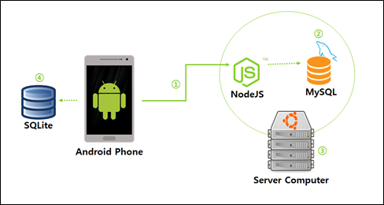
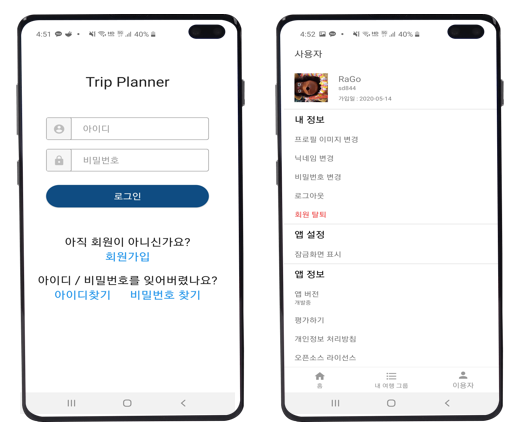
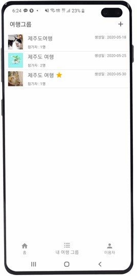
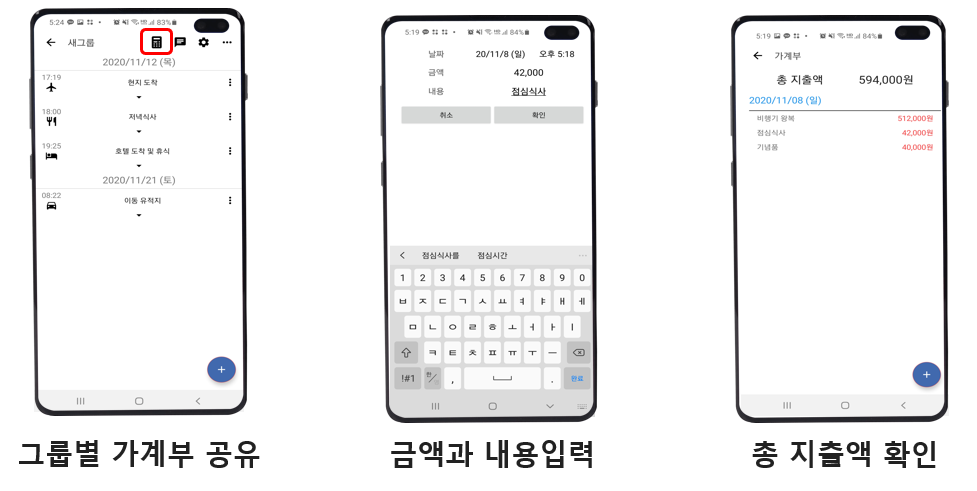
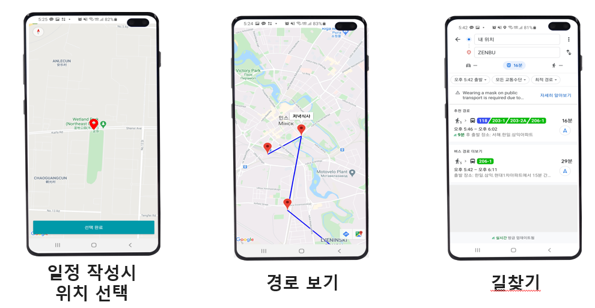

# 트립 매니저 (안드로이드 여행 일정 애플리케이션)
## 작품 개요
---
- 국내 또는 해외로 여행을 가기 전 함께 가는 지인들과 일정을 계획하고 공유할 수 있는 안드로이드 애플리케이션

## 차별화 전략
---

기존 출시 되어있는 여행 플랜 안드로이드 어플리케이션 ‘핫츠고 플랜’과 ‘트립노츠’ 분석했다. 핫츠고 플랜은 여행일정 관리, 코드로 여행일정 공유, 친구와 함께 수정하기, 가계부 기능, PDF, 백업, 공유 등의 기능을 제공한다. 하지만 다양한 기능이 흩어져 있어 UI가 복잡하여 사용에 불편함이 있다. 트립노츠는 일정작성 기능과 가계부 기능만 제공하여 군더더기 없이 깔끔하게 필요한 기능만 제공한다.

__이 프로젝트의 차별화 전략__

1. 지도기반 일정 확인
2. 가계부

기존 출시 제품을 분석하였을 때 ‘일정작성’ ‘일정공유’ 등의 기본 기능은 모두 유사한 경향을 보였다. 여기서 우리팀은 차별화 전략으로 그룹 기능을 강조하기로 하였다 여행은 보통 2인 이상으로 가는 경우가 많아 타 어플처럼 일정만 공유하는건 의미가 없다고 생각했다. 그룹별로 공유할 수 있는 일정과 가계부를 제공하며 그룹별로 채팅기능을 제공하여 편리함을 추구하였다. 또한 일부 제품에만 있는 지도 기능을 추가하여 일정별 경로를 지도로 한눈에 확인할 수 있도록 개발할 예정이다.

## 시스템 구성도
---

안드로이드 스마트폰과 개인용 PC로 구성된 서버를 사용한다.
로컬 DB로 SQLite를 사용하며 일부 데이터 저장에는 SharedPreferences를 사용한다. REST API를 제공하기 위해 Node.js로 서버를 구동하며 DB로는 MySQL을 사용한다.

## UI/UX
---
1. 회원기능

    

2. 그룹기능

    

3. 그룹기능 - 채팅방

    

4. 그룹기능 - 가계부

    

5. 그룹기능 - 지도
    

6. 기타 기능
    

시연 영상
---

